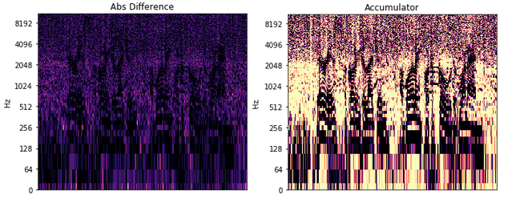

# DNP
Audio Denoising with Deep Network Priors

This repository provides a PyTorch implementation of "Audio Denoising with Deep Network Priors"

The method trains on noisy audio signal and provides a the clean underlying signal. **Comparison with traditional unsupervised methods can be found [here](https://mosheman5.github.io/DNP/)**

The method is completely unsupervised and only trains on the specific audio clip that is being denoised.

The algorithm is based on the observation that modeling noise in the signal is harder than a clean signal. 
During the fitting we observe flactuations in different stages of the train. 
By calculating the amount of difference between outputs in the time-frequency domain we create a robust spectral mask used for denoising the noisy output. 


## Dependencies
A conda environment file is available in the repository.
* Python 3.6 +
* Pytorch 1.0
* Torchvision
* librosa
* tqdm
* scipy
* soundfile

## Usage

### 1. Cloning the repository & setting up conda environment
```
$ git clone https://github.com/mosheman5/DNP.git
$ cd DNP/
```
For creating and activating the conda environment:
```
$ conda env create -f environment.yml
$ conda activate DNP
```
 
### 2. Testing

To test on the demo speech file:

```
$ python DNP.py --run_name demo --noisy_file demo.wav --samples_dir samples --save_every 50 --num_iter 5000 --LR 0.001
```

To test on any other audio file insert the file path after the ```--noisy_file``` option.

A jupyter notebook with visualization is available: ```dnp.ipynb```

## Reference
If you found this code useful, please cite the following paper:
```
@article{michelashvili2019DNP,
  title={Audio Denoising with Deep Network Priors},
  author={Michael Michelashvili and Lior Wolf},
  journal={arXiv preprint arXiv:1904.07612},
  year={2019}
}
```

## Acknowledgement
The implemantation of the network architecture is taken from [Wave-U-Net](https://github.com/f90/Wave-U-Net)
